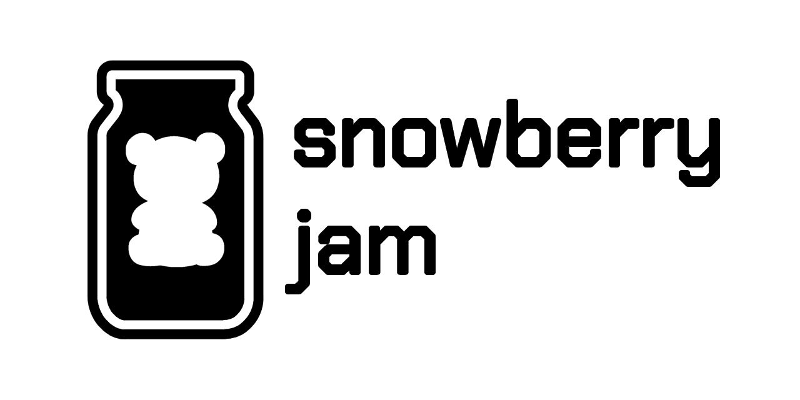

# Snowberry Jam
A JSON-based programming language with a visual compiler made in Java.



## Smooth Logic, Clear Vision.
Snowberry Jam is a programming language designed to resemble the save file of a block-coding editor. It offers diverse *"code blocks"* which allows users to make basic console apps.

## Documentation
Here's a list of different documentation resources directly related to this project.
- [**Snowberry Jam Language Guide**](https://snowberry-jam.vercel.app/) `[Work In Progress]`
- [**Compiler Javadoc Documentation**](https://wyu4.github.io/snowberry-jam/javadoc/)
- [**Compiler UML Diagram**](https://wyu4.github.io/snowberry-jam/UML.svg)

## Source Files
Snowberry Jam source files end with the `.snowb` suffix. The contents of these follow the JSON syntax.

### VSCode Setup
In order for VSCode to treat this filetype properly, hold down `ctrl + shift + p`, head to `preferences`, and add the following block to `settings.json`:
```json
"files.associations": {
    "*.snowb": "json"
}
```

## Manual Building A Copy
Users have the option to manually build their own copy of Snowberry Jam. You can get a copy of the source code from this repository, or by using [Git](https://git-scm.com/downloads):
```bash
git clone https://github.com/wyu4/snowberry-jam.git
```

> If commands throw errors, try switching IDEs or running them in a seperate terminal app.

### Build Commands:
> Before continuing, make sure to have [Maven](https://maven.apache.org/install.html) installed. Any files generated from builds can be found in the `target` folder.

Here are some useful commands:

#### Reset Build Directory
Clear the contents of the build directory.
```bash
mvn clean
```

#### Test Package
Build a custom runtime (along with auto-generated resources), which can be used to create an installation.
```bash
mvn clean package
```

#### Generate Installer
Build a custom runtime (along with auto-generated resources), as well as an installation of Snowberry Jam.
```bash
mvn clean install
```

### Target Folder Structure
Anything generated by the build process will be moved into a `target` folder. Here's where the important stuff can be found:

| **Item**                 | **Path**                                               |
|--------------------------|--------------------------------------------------------|
| Runtime Image            | `target/sj-image`                                      |
| Modularized JARs         | `target/packaging/input`                               |
| Shaded JAR Artifact      | `target/packaging/SnowberryJam-[VERSION]-MANIFEST.jar` |
| Generated Installers     | `target/packaging/installations`                       |
| Generated UMLs           | `target/generated-diagrams`                            |
| Generated Javadoc Report | `target/reports/apidocs`                               |

# Additional Resources
